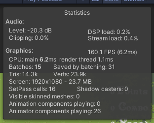
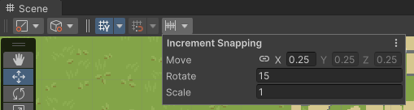
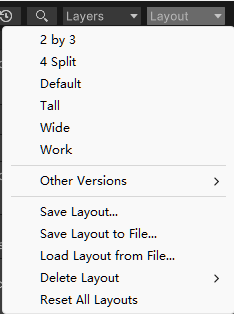
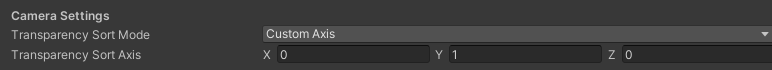

# Unity开发技巧(施工中)

    本文档是笔者在学 Unity，和做游戏开发时的笔记。放在一个文档里是方便检索，读者可以直接 ctrl + f 搜索关键词。

---
## ✪ 快捷键

### QWERTY

  

这六个常用操作，对应的快捷键分别是 QWERTY。

### 查找或自定义快捷键

Unity支持自定义快捷键，地址如下：

```
Windows: Edit -> Shortcuts
Mac: Unity -> Shortcuts
```

在这里也可以查找快捷键，界面如下：

  


### 展开或收起所有层级

假设你的 Hierarchy 窗口里的东西层级非常多，想要一次性收起或者打开所有层级的子物体。只需要按住ALT键点击 GameObject 左边的小三角就可以。

### 摄像机对准

按 F 键可以直接让摄像机对准你选中的物体。

### 跟踪物体

按两下 F 键可以直接让摄像机跟踪物体。

### 顶点对其

按住 V 拖拽物体，可以自动顶点对其。

---

## ✪ 摄像机操作

### 摄像机是什么时候移动的？

摄像机是在 LateUpdate 移动的，晚于 Update，这样设计是避免摄像机移动了，但是场景里东西还没有渲染完。


### 屏幕坐标转世界坐标

```csharp
transform.position = new Vector2(Camera.main.ScreenToWorldPoint(Input.mousePosition).x,Camera.main.ScreenToWorldPoint(Input.mousePosition).y);
```

### 控制摄像机自由移动

把以下代码挂在摄像机上即可：

```csharp
[RequireComponent(typeof(Camera))]
public class FreelyCameraMoveController : MonoBehaviour
{
    public float speed = 4.0f;
    public float shiftSpeed = 16.0f;
    public bool showInstructions = true;

    private Vector3 startEulerAngles;
    private Vector3 startMousePosition;
    private float realTime;

    void OnEnable()
    {
        realTime = Time.realtimeSinceStartup;
    }

    void Update()
    {
        float forward = 0.0f;
        if (Input.GetKey(KeyCode.W) || Input.GetKey(KeyCode.UpArrow))
        {
            forward += 1.0f;
        }

        if (Input.GetKey(KeyCode.S) || Input.GetKey(KeyCode.DownArrow))
        {
            forward -= 1.0f;
        }

        float up = 0.0f;
        if (Input.GetKey(KeyCode.E))
        {
            up += 1.0f;
        }

        if (Input.GetKey(KeyCode.Q))
        {
            up -= 1.0f;
        }

        float right = 0.0f;
        if (Input.GetKey(KeyCode.D) || Input.GetKey(KeyCode.RightArrow))
        {
            right += 1.0f;
        }

        if (Input.GetKey(KeyCode.A) || Input.GetKey(KeyCode.LeftArrow))
        {
            right -= 1.0f;
        }

        float currentSpeed = speed;
        if (Input.GetKey(KeyCode.LeftShift) || Input.GetKey(KeyCode.RightShift))
        {
            currentSpeed = shiftSpeed;
        }

        float realTimeNow = Time.realtimeSinceStartup;
        float deltaRealTime = realTimeNow - realTime;
        realTime = realTimeNow;

        Vector3 delta = new Vector3(right, up, forward) * currentSpeed * deltaRealTime;

        transform.position += transform.TransformDirection(delta);

        Vector3 mousePosition = Input.mousePosition;

        if (Input.GetMouseButtonDown(1))
        {
            startMousePosition = mousePosition;
            startEulerAngles = transform.localEulerAngles;
        }

        if (Input.GetMouseButton(1))
        {
            Vector3 offset = mousePosition - startMousePosition;
            transform.localEulerAngles = startEulerAngles + new Vector3(-offset.y * 360.0f / Screen.height,
                offset.x * 360.0f / Screen.width, 0.0f);
        }
    }
    void OnGUI()
    {
        if (showInstructions)
        {
            GUI.Label(new Rect(10.0f, 10.0f, 600.0f, 400.0f),
                "WASD 前后左右移动相机\n " +
                "EQ 上升、降低相机高度\n" +
                "鼠标右键旋转相机\n");
        }
    }
}
```
### 在Scene窗口里绘制摄像机视野范围

```csharp
public class ShowCameraFieldOfView : MonoBehaviour
{
    private Camera mainCamera;
    private void OnDrawGizmos()
    {
        if (mainCamera == null)
            mainCamera = Camera.main;
        Gizmos.color = Color.green; 
        Gizmos.matrix = Matrix4x4.TRS(mainCamera.transform.position, mainCamera.transform.rotation, Vector3.one);
        Gizmos.DrawFrustum(Vector3.zero, mainCamera.fieldOfView, mainCamera.farClipPlane, mainCamera.nearClipPlane, mainCamera.aspect);
    }
}

```

---

## ✪ 按键

### 获取正在按下的键
```csharp
if (Input.anyKeyDown) 
    {
        foreach (KeyCode keyCode in Enum.GetValues(typeof(KeyCode)))
        {
            if (Input.GetKeyDown(keyCode))
            {
                //keyCode就是正在按下的键
            }
        }
    }
```

### 获取双击

```csharp
public class DoubleClickMouseButton : MonoBehaviour
{

    private float doubleClickTime = 0.2f; // 双击的时间间隔
    private double lastClickTime;

    void Start()
    {
        lastClickTime = Time.realtimeSinceStartup;
    }

    private void Update()
    {
        DoubleClickMouseButtonEvent(0, () =>
        {
            // 双击要执行的事件
        });
    }

    private void DoubleClickMouseButtonEvent(int mouseBtnIndex, Action action)
    {
        if (Input.GetMouseButtonDown(mouseBtnIndex))
        {
            if (Time.realtimeSinceStartup - lastClickTime < doubleClickTime)
            {
                action();
            }

            lastClickTime = Time.realtimeSinceStartup;
        }
    }
}
```

---

## ✪ GameObject 操作

### 延迟销毁

```csharp
Destroy(gameObject, time);// time 是延迟的时间
```

### 移除组件

Destroy 也可以移除组件：

```csharp
Destroy(GetComponent());
```

### 不需要创建空物体就可以执行代码

不需要继承 MonoBehavior 并挂接在物体身上,只要加入：

```csharp
[RuntimeInitializeOnLoadMethod(RuntimeInitializeLoadType.AfterSceneLoad)]
```

### 获取所有的子 GameObject

```csharp

for (int i = 0; i < transform.childCount; i++)
{
    //transform.GetChild(i).gameObject
}
```
这种方法可以获取所有的子物体，但是不包含孙物体，如果需要孙物体，可以下面这么写：

```csharp
foreach (var child in GetComponentsInChildren<Transform>())
{
    Debug.Log(child.name);
}
```
如果需要精确定位子物体和孙物体，比如某些物体你是不想包含进去的，那么可以给需要的物体加上 tag，然后通过下面这种方法获取：

```csharp
GameObject[] name = GameObject.FindGameObjectsWithTag("need");
foreach(var son in name)
{
    Debug.Log(son.name);
}

```

注意，用 foreach 的写法比较简单，但是在 C# 里，foreach 的效率非常差，所以对效率敏感，还是要改成 for 的写法。

### 防止重新加载时被销毁
比如防止背景音乐暂停等，可以加入：

```csharp
DontDestroyOnLoad(GameObject);
```

### 用 Rigidbody 停止物体

可以通过 Rigidbody 停止一个物体的运动，改变 RigidbodyType2D 就可以：

```csharp
rb.bodyType = RigidbodyType2D.Static;
```

### 层剔除

可以通过位运算，实现剔除一些 Layer，比如：

```csharp
LayerMask mask = 1 << 2; // 开启Layer2
LayerMask mask = 0 << 3; // 剔除Layer3
LayerMask mask = 1 << 2 | 1 << 3; // 开启Layer2和Layer3

```

---

## ✪ 编辑器

### 运行模式着色

Unity默认在运行模式下，场景内的操作是不会保留的，所以很容易出现开发者没注意是运行模式，进行了修改，结果没有保存的情况。那么可以使用运行模式着色，提醒开发者正在运行模式内。设置地址如下：

```
Windows: Edit -> Preference -> Colors -> Playmode tint
Mac: Unity -> Preference-> Colors -> Playmode tint
```

  

只需要修改这里的颜色后，在运行模式时，窗口就会被加上颜色，如下：

  

### 运行模式下改动

假如你也根本没有注意到运行模式的着色，还是修改了内容，也有办法保存。在运行时，右键点击你修改过的物体，然后选择Copy Component，结束运行模式后，再Paste Component Values即可。

  


  


### 使用 Debug.log 的第二个参数，实现调试时定位到 GameObject

我们调试时，有可能会遇到一堆 Debug.log 的信息，只需要加入第二个参数，在 Console 窗口里直接点击这条信息，就可以自动定位到对应的 GameObject。

```csharp 
Debug.Log("试试这个", this.gameObject);
```
### 使用 Debug.Break() 暂停调试

在代码里使用 Debug.Break() 直接在所在位置暂停。

### 修改显示顺序

开发者可以用代码修改物体的现实顺序，方法是：

```csharp
transform.SetSiblingIndex(index)
```

### Stats窗口

Unity 的 Stats 窗口可以看大概的运行参数，在 Game 窗口的右上角。


  


### 修改移动设置

开发者按住 ctrl 移动物体时，可以移动固定一个范围。

开发者也可以修改编辑器中的移动的设置，控制一次移动多少单位，2021 以前版本的 Unity 在：

```csharp
Edit -> Snap Settings
```

2021 后版的 Unity 在：

  


### 保存布局

开发者可以保存自己的界面布局，比如根据不同的开发状态设置不同的布局方式，位置如下：

  


### 在代码里组织 Inspector 的信息

```charp
[SerializeField]
```
让一个 Private 变量在 Inspector 中显示。

```csharp
[HideInInspector]
```

让一个 Public 变量在 Inspector 中隐藏。

```csharp
[FormerlySerializedAs("Miao")]
```

在 Inspector 中重命名一个变量。


```csharp
[Header("移动速度")]
public float speed;
```

增加一个标题，效果如下：

  

```csharp
[Tooltip("移动速度，浮点类型")]
public float speed;
```
增加一个鼠标指向的提示，效果如下：

  

```csharp
public float speed;
[Space(50)]
public Transform target;
```

增加空行，数字为空行宽度，效果如下：

  


### 快捷方式

在 Windows 的文件管理器中创建一个快捷方式，然后拖拽到 Unity 中也可以直接使用。一些开发常用的外部文件，可以在 Unity 里直接打开，节省了切换窗口的时间。

### Project 中搜索

在 Project 中搜索可以直接填写文件类型：

```csharp
name t:type
```

### Resources 文件夹
Resources 文件夹允许你在代码中通过文件路径和名称来访问资源。放在这一文件夹的资源永远被包含进打包文件中，即使它没有被使用。在某些情况下 Resources 使用起来很方便，但是 Resources 隐患非常大。比如 Resources 会影响启动和构建的时间，比如伴随着文件增多会变得非常难以管理，比如 Resources 内的文件是无法动态更新的。


---

## ✪ 硬件和系统

### 获取硬件配置信息

```csharp
public class GetDeviceInfo : MonoBehaviour
{
    void OnGUI()
    {
        GUILayout.Space(10);
        GUILayout.Label("设备的详细信息");
        GUILayout.Space(8);
        GUILayout.Label("设备模型:" + SystemInfo.deviceModel);
        GUILayout.Space(8);
        GUILayout.Label("设备名称:" + SystemInfo.deviceName);
        GUILayout.Space(8);
        GUILayout.Label("设备类型:" + SystemInfo.deviceType.ToString());
        GUILayout.Space(8);
        GUILayout.Label("设备唯一标识符:" + SystemInfo.deviceUniqueIdentifier);
        GUILayout.Space(8);
        GUILayout.Label("是否支持纹理复制:" + SystemInfo.copyTextureSupport.ToString());
        GUILayout.Label("显卡ID:" + SystemInfo.graphicsDeviceID.ToString());
        GUILayout.Label("显卡名称:" + SystemInfo.graphicsDeviceName);
        GUILayout.Label("显卡类型:" + SystemInfo.graphicsDeviceType.ToString());
        GUILayout.Label("显卡供应商:" + SystemInfo.graphicsDeviceVendor);
        GUILayout.Label("显卡供应商ID:" + SystemInfo.graphicsDeviceVendorID.ToString());
        GUILayout.Label("显卡版本号:" + SystemInfo.graphicsDeviceVersion);
        GUILayout.Label("显存大小（单位：MB）:" + SystemInfo.graphicsMemorySize);
        GUILayout.Label("显卡是否支持多线程渲染:" + SystemInfo.graphicsMultiThreaded.ToString());
        GUILayout.Label("支持的渲染目标数量:" + SystemInfo.supportedRenderTargetCount.ToString());
        GUILayout.Label("系统内存大小(单位：MB):" + SystemInfo.systemMemorySize.ToString());
        GUILayout.Label("操作系统:" + SystemInfo.operatingSystem);
    }
}
```

### 定时

```csharp
float timer -= Time.deltaTime; // timer就是时间
```

之后可以通过以下函数，把浮点的时间转换为显示时间：

```csharp
public static string FormatTime(float seconds)
{
    TimeSpan ts = new TimeSpan(0, 0, Convert.ToInt32(seconds));
    string str = "";
    if (ts.Hours > 0)
    {
        str = ts.Hours.ToString("00") + ":" + ts.Minutes.ToString("00") + ":" + ts.Seconds.ToString("00");
    }
    if (ts.Hours == 0 && ts.Minutes > 0)
    {
        str = ts.Minutes.ToString("00") + ":" + ts.Seconds.ToString("00");
    }
    if (ts.Hours == 0 && ts.Minutes == 0)
    {
        str = "00:" + ts.Seconds.ToString("00");
    }
    return str;
}
```


### 获取系统时间和设置时间格式

```csharp
DateTime currectDateTime = new DateTime();
currectDateTime = DateTime.Now; //获取当前年月日时分秒 
Debug.Log(currectDateTime); // 06/02/2022 11:28:54
Debug.Log(currectDateTime.Year); //获取当前年
Debug.Log(currectDateTime.Month); //获取当前月
Debug.Log(currectDateTime.Day); //获取当前日
Debug.Log(currectDateTime.Hour); //获取当前时
Debug.Log(currectDateTime.Minute); //获取当前分
Debug.Log(currectDateTime.Second); //获取当前秒
Debug.Log(currectDateTime.Millisecond); //获取当前毫秒
Debug.Log(currectDateTime.ToString("f")); //获取当前日期（中文显示）不显示秒   2022年6月2日 11:35
Debug.Log(currectDateTime.ToString("y")); //获取当前年月   2022年6月
Debug.Log(currectDateTime.ToString("m")); //获取当前月日   6月2日
Debug.Log(currectDateTime.ToString("D")); //获取当前中文年月日   2022年6月2日
Debug.Log(currectDateTime.ToString("t")); //获取当前时分   11:39
Debug.Log(currectDateTime.ToString("s")); //获取当前时间   2022-06-02T11:40:32
Debug.Log(currectDateTime.ToString("u")); //获取当前时间   2022-06-02 11:40:32Z
Debug.Log(currectDateTime.ToString("g")); //获取当前时间   2022/6/2 11:40
Debug.Log(currectDateTime.ToString("r")); //获取当前时间   Thu, 02 Jun 2022 11:40:32 GMT
Debug.Log(currectDateTime.ToString("yyyy-MM-dd HH:mm:ss:ffff")); //2022-06-02 11:50:08:4414
Debug.Log(currectDateTime.ToString("yyyy-MM-dd HH:mm:ss")); //2022-06-02 11:50:37
Debug.Log(currectDateTime.ToString("yyyy/MM/dd HH:mm:ss")); //2022/06/02 11:51:17
Debug.Log(currectDateTime.ToString("yyyy/MM/dd HH:mm:ss dddd")); //2022/06/02 11:53:43 星期四
Debug.Log(currectDateTime.ToString("yyyy年MM月dd日 HH时mm分ss秒 ddd")); //2022/06/02 11:53:43 周四
Debug.Log(currectDateTime.ToString("yyyyMMdd HH:mm:ss")); //20220602 11:53:02
Debug.Log(currectDateTime.AddDays(100).ToString("yyyy-MM-dd HH:mm:ss")); //获取100天后的时间  2022-09-10 11:57:24

```

### 退出游戏

```csharp
#if UNITY_EDITOR
	UnityEditor.EditorApplication.isPlaying = false;
#else
	Application.Quit();
#endif
```
### 获取系统语言

```csharp
using UnityEngine;

public class Example : MonoBehaviour
{
    void Start()
    {
        if (Application.systemLanguage == SystemLanguage.French)
        {
            Debug.Log("This system is in French. ");
        }
    }
}
```

### 文件操作
```csharp
Application.dataPath; //Asset文件夹的绝对路径
Application.streamingAssetsPath;  //StreamingAssets文件夹的绝对路径（要先判断是否存在这个文件夹路径）
Application.persistentData ; //可读写

AssetDatabase.GetAllAssetPaths; //获取所有的资源文件（不包含meta文件）
AssetDatabase.GetAssetPath(object) //获取object对象的相对路径
AssetDatabase.Refresh(); //刷新
AssetDatabase.GetDependencies(string); //获取依赖项文件

Directory.Delete(p, true); //删除P路径目录
Directory.Exists(p);  //是否存在P路径目录
Directory.CreateDirectory(p); //创建P路径目录
```

### AssetsBundle 打包
```csharp
using UnityEditor;
using System.IO;

public class CreateAssetBundles 
{

    [MenuItem("Assets/Build AssetBundles")]
    static void BuildAllAssetBundles()
    {
        string dir = "AssetBundles";
        if (Directory.Exists(dir) == false)
        {
            Directory.CreateDirectory(dir);
        }
        BuildPipeline.BuildAssetBundles(dir, BuildAssetBundleOptions.ChunkBasedCompression, BuildTarget.StandaloneWindows64);
    }
}
```

### AssetsBundle 加载

从内存区域创建一个AssetBundle 。优点：可以通过 byte[] 加载加密过的AB包，缺点：内存占用高，会占用两份内存。
 ```csharp
IEnumerator Start()
{
    string path = "AssetBundles/wall.unity3d";
    AssetBundleCreateRequest request =AssetBundle.LoadFromMemoryAsync(File.ReadAllBytes(path));
    yield return request;
    AssetBundle ab = request.assetBundle;
    GameObject wallPrefab = ab.LoadAsset<GameObject>("Cube");
    Instantiate(wallPrefab);
}

 ```
 从硬盘的文件中加载一个 AssetBundle。优点：加载速度快，占用内存小。缺点：加载加密的 AB 包可能会失败。
 ```csharp
 IEnumerator Start()
{
    string path = "AssetBundles/wall.unity3d";
    AssetBundleCreateRequest request = AssetBundle.LoadFromFileAsync(path);
    yield return request;
    AssetBundle ab = request.assetBundle;
    GameObject wallPrefab = ab.LoadAsset<GameObject>("Cube");
    Instantiate(wallPrefab);
}
```
在线加载。
```csharp
IEnumerator Start()
{
    string uri = @"http://localhost/AssetBundles/cubewall.unity3d";
    UnityWebRequest request =   UnityWebRequest.GetAssetBundle(uri);
    yield return request.Send();
    AssetBundle ab = DownloadHandlerAssetBundle.GetContent(request);
    GameObject wallPrefab = ab.LoadAsset<GameObject>("Cube");
    Instantiate(wallPrefab);
}
```
---

## ✪ 精灵

### 设置

Unity 里设计到 2D 游戏的遮挡关系，有一个很简单的设置办法。

1. 在 Edit -> Project Settings -> Graphics -> CameraSetting 按照如下设置：

  

2. 把每个角色的 Pivot 放在图片的脚底。
3. 把每个角色的 Sprite Sort Point 改成 Pivot。

这样 2D 角色就能够形成自然的遮挡关系。

---

## ✪ 动画

### 倒放动画

把动画的 speed 调整为 -1 。

---

## ✪ 音频

### 音频压缩

LoadType 有三种，分别为：

* DeCompressOnLoad :音频文件将在加载后立即解压缩，对较小的音效使用此选项可避免动态解压缩的性能开销。千万不要对大文件使用这个选项，会增大内存开支。
* CompressedInMemory 将声音压缩在内存中，播放时解压缩。适合体积较大的音效文件。
* Streaming 动态解码声音，此方法是使用最小量的内存来缓冲从磁盘逐渐读取并在运行中解码的压缩数据。适合大文件，比如背景音等。

Preload Audio Data：这个选项如果启用音频剪辑将在场景加载时预先加载，也就是当场景开始播放时，所有的 AudioClips 已经完成了加载。注意选上后，游戏的预加载时间会边长，但是游戏过程中的加载时间会变短。

Compression Format 有三种，分别为：

* PCM：适合短音效。
* ADPCM：适合频繁使用的音效。
* Vorbis：适合长音效，尤其是背景音。

---

## ✪ C#

### Random.Range 范围界定

当 Range 的参数是 float 时，返回一个随机浮点数，在 min（包含） 和 max（包含） 之间。
当 Range 的参数是 int 时，返回一个随机整数，在 min（包含） 和 max（排除） 之间。
注意两者是不同的。


### 安全的生成随机数

我们最常用的生成随机数是 Random()，如下：

```csharp
Random number = new Random();
```

但在高并发下，这种方法很可能会短时间生成大量相同的随机数。这种情况可以使用 RandomNumberGenerator。使用方法如下：

```csharp
var rand = System.Security.Cryptography.RandomNumberGenerator.Create();
byte[] bytes = new byte[200]; 
rand.GetBytes(bytes);
```
在 .Net 6.0 后，支持一行生成：

```csharp
var rand=RandomNumberGenerator.GetBytes(200);
```

### 随机布尔值

```csharp
bool trueOrFalse = (Random.value > 0.5f);
```


### foreach 期间不能修改
下面的操作会在运行时报错，因为 foreach 期间是不能修改的。

```csharp
foreach (int item in ls)
{
    ls.Remove(item);
}
```

### WaitForSeconds 的问题

如果在协程中使用 WaitForSeconds ，那么注意当 timeScale 为0时，协程中的 WaitForSeconds 会失效。

解决办法是使用 WaitForSecondsRealtime 。

### readonly

如果确定不会变动的字符串，可以使用 readonly string 创建，内存开销会降低。

```csharp
public readonly string stringname = "Hello World";
```


### InvokeRepeating

InvokeRepeating 可以一直让一段代码执行，甚至 SetActive(false) 后也在执行。

```csharp

public class ExampleScript : MonoBehaviour
{
    public Rigidbody projectile;

    void Start()
    {
        InvokeRepeating("LaunchProjectile", 2.0f, 0.3f);
    }

    void LaunchProjectile()
    {
        Rigidbody instance = Instantiate(projectile);

        instance.velocity = Random.insideUnitSphere * 5;
    }
}

```

---

##  ✪ 数学和算法

### 尽量避免使用 Distance

我们有时候会用下面的方法计算向量距离：

```chsarp
Vector3.Distance(A.position,B.position);
```
但如果需要频繁计算，这种方法效率很低。而下面的方法效率更高：

```csharp
 (A.position - B.position).sqrMagnitude;
```