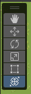
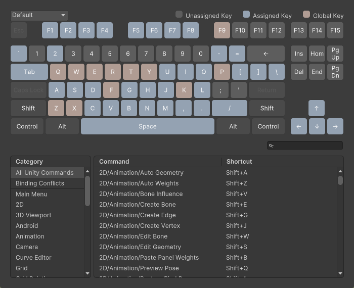
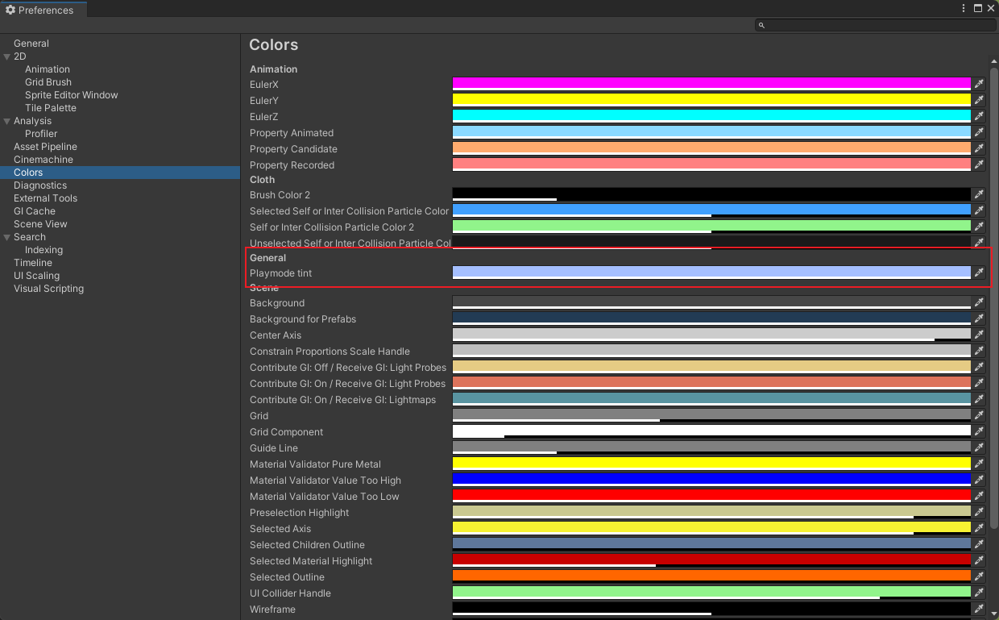
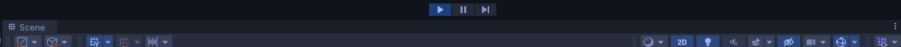
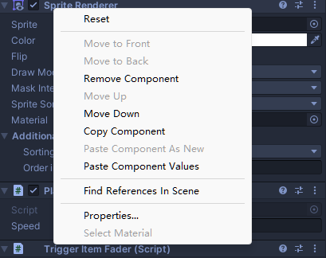
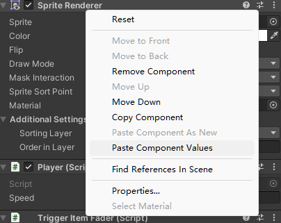
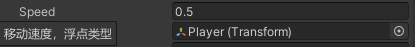
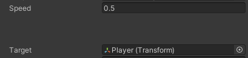

# Unity开发技巧(施工中)

    本文档是笔者在学Unity，和近两年做游戏开发时的笔记。

---
## ✪ 常用快捷键

### QWERTY

  

这六个常用操作，对应的快捷键分别是 QWERTY。

### 查找或自定义快捷键

Unity支持自定义快捷键，地址如下：

```
Windows: Edit -> Shortcuts
Mac: Unity -> Shortcuts
```

在这里也可以查找快捷键，界面如下：

  


### 展开或收起所有层级

假设你的 Hierarchy 窗口里的东西层级非常多，想要一次性收起或者打开所有层级的子物体。只需要按住ALT键点击 GameObject 左边的小三角就可以。

---

## ✪ 摄像机操作

### 屏幕坐标转世界坐标

```csharp
transform.position = new Vector2(Camera.main.ScreenToWorldPoint(Input.mousePosition).x,Camera.main.ScreenToWorldPoint(Input.mousePosition).y);
```

### 控制摄像机自由移动

把以下代码挂在摄像机上即可：

```csharp
[RequireComponent(typeof(Camera))]
public class FreelyCameraMoveController : MonoBehaviour
{
    public float speed = 4.0f;
    public float shiftSpeed = 16.0f;
    public bool showInstructions = true;

    private Vector3 startEulerAngles;
    private Vector3 startMousePosition;
    private float realTime;

    void OnEnable()
    {
        realTime = Time.realtimeSinceStartup;
    }

    void Update()
    {
        float forward = 0.0f;
        if (Input.GetKey(KeyCode.W) || Input.GetKey(KeyCode.UpArrow))
        {
            forward += 1.0f;
        }

        if (Input.GetKey(KeyCode.S) || Input.GetKey(KeyCode.DownArrow))
        {
            forward -= 1.0f;
        }

        float up = 0.0f;
        if (Input.GetKey(KeyCode.E))
        {
            up += 1.0f;
        }

        if (Input.GetKey(KeyCode.Q))
        {
            up -= 1.0f;
        }

        float right = 0.0f;
        if (Input.GetKey(KeyCode.D) || Input.GetKey(KeyCode.RightArrow))
        {
            right += 1.0f;
        }

        if (Input.GetKey(KeyCode.A) || Input.GetKey(KeyCode.LeftArrow))
        {
            right -= 1.0f;
        }

        float currentSpeed = speed;
        if (Input.GetKey(KeyCode.LeftShift) || Input.GetKey(KeyCode.RightShift))
        {
            currentSpeed = shiftSpeed;
        }

        float realTimeNow = Time.realtimeSinceStartup;
        float deltaRealTime = realTimeNow - realTime;
        realTime = realTimeNow;

        Vector3 delta = new Vector3(right, up, forward) * currentSpeed * deltaRealTime;

        transform.position += transform.TransformDirection(delta);

        Vector3 mousePosition = Input.mousePosition;

        if (Input.GetMouseButtonDown(1))
        {
            startMousePosition = mousePosition;
            startEulerAngles = transform.localEulerAngles;
        }

        if (Input.GetMouseButton(1))
        {
            Vector3 offset = mousePosition - startMousePosition;
            transform.localEulerAngles = startEulerAngles + new Vector3(-offset.y * 360.0f / Screen.height,
                offset.x * 360.0f / Screen.width, 0.0f);
        }
    }
    void OnGUI()
    {
        if (showInstructions)
        {
            GUI.Label(new Rect(10.0f, 10.0f, 600.0f, 400.0f),
                "WASD 前后左右移动相机\n " +
                "EQ 上升、降低相机高度\n" +
                "鼠标右键旋转相机\n");
        }
    }
}
```
### 在Scene窗口里绘制摄像机视野范围

```csharp
public class ShowCameraFieldOfView : MonoBehaviour
{
    private Camera mainCamera;
    private void OnDrawGizmos()
    {
        if (mainCamera == null)
            mainCamera = Camera.main;
        Gizmos.color = Color.green; 
        Gizmos.matrix = Matrix4x4.TRS(mainCamera.transform.position, mainCamera.transform.rotation, Vector3.one);
        Gizmos.DrawFrustum(Vector3.zero, mainCamera.fieldOfView, mainCamera.farClipPlane, mainCamera.nearClipPlane, mainCamera.aspect);
    }
}

```

---

## ✪ 按键相关

### 获取正在按下的键
```csharp
if (Input.anyKeyDown) 
    {
        foreach (KeyCode keyCode in Enum.GetValues(typeof(KeyCode)))
        {
            if (Input.GetKeyDown(keyCode))
            {
                //keyCode就是正在按下的键
            }
        }
    }
```

### 获取双击

```csharp
public class DoubleClickMouseButton : MonoBehaviour
{

    private float doubleClickTime = 0.2f; // 双击的时间间隔
    private double lastClickTime;

    void Start()
    {
        lastClickTime = Time.realtimeSinceStartup;
    }

    private void Update()
    {
        DoubleClickMouseButtonEvent(0, () =>
        {
            // 双击要执行的事件
        });
    }

    private void DoubleClickMouseButtonEvent(int mouseBtnIndex, Action action)
    {
        if (Input.GetMouseButtonDown(mouseBtnIndex))
        {
            if (Time.realtimeSinceStartup - lastClickTime < doubleClickTime)
            {
                action();
            }

            lastClickTime = Time.realtimeSinceStartup;
        }
    }
}
```

---

## ✪ 运行环境

### 运行模式着色

Unity默认在运行模式下，场景内的操作是不会保留的，所以很容易出现开发者没注意是运行模式，进行了修改，结果没有保存的情况。那么可以使用运行模式着色，提醒开发者正在运行模式内。设置地址如下：

```
Windows: Edit -> Preference -> Colors -> Playmode tint
Mac: Unity -> Preference-> Colors -> Playmode tint
```

  

只需要修改这里的颜色后，在运行模式时，窗口就会被加上颜色，如下：

  

### 运行模式下改动

假如你也根本没有注意到运行模式的着色，还是修改了内容，也有办法保存。在运行时，右键点击你修改过的物体，然后选择Copy Component，结束运行模式后，再Paste Component Values即可。

  


  


### 使用Debug.log 的第二个参数，实现调试时定位到GameObject

我们调试时，有可能会遇到一堆Debug.log的信息，只需要加入第二个参数，在Console窗口里直接点击这条信息，就可以自动定位到对应的GameObject。

```csharp 
Debug.Log("试试这个", this.gameObject);
```
### 使用Debug.Break()暂停调试

在代码里使用Debug.Break()直接在所在位置暂停。

### 不需要创建空物体就可以执行代码

不需要继承MonoBehavior并挂接在物体身上,只要加入：

```csharp
[RuntimeInitializeOnLoadMethod(RuntimeInitializeLoadType.AfterSceneLoad)]
```

---

## ✪ GameObject操作

### 延迟销毁

```csharp
Destroy(gameObject, time);// time 是延迟的时间
```

---

## ✪ 编辑器

### 在代码里组织Inspector的信息

```csharp
[Header("移动速度")]
public float speed;
```

增加一个标题，效果如下：

  

```csharp
[Tooltip("移动速度，浮点类型")]
public float speed;
```
增加一个鼠标指向的提示，效果如下：

  

```csharp
public float speed;
[Space(50)]
public Transform target;
```

增加空行，数字为空行宽度，效果如下：

  


### Resources文件夹
Resources 文件夹允许你在脚本中通过文件路径和名称来访问资源。放在这一文件夹的资源永远被包含进build中，即使它没有被使用。在某些情况下 Resources 使用起来非常方便，但是 Resources 隐患非常大。比如 Resources 会影响启动和构建的时间，比如伴随着文件增多会变得非常难以管理，比如 Resources 内的文件是无法动态更新的。


---

## ✪ 硬件和系统相关

### 获取硬件配置信息

```csharp
public class GetDeviceInfo : MonoBehaviour
{
    void OnGUI()
    {
        GUILayout.Space(10);
        GUILayout.Label("设备的详细信息");
        GUILayout.Space(8);
        GUILayout.Label("设备模型:" + SystemInfo.deviceModel);
        GUILayout.Space(8);
        GUILayout.Label("设备名称:" + SystemInfo.deviceName);
        GUILayout.Space(8);
        GUILayout.Label("设备类型:" + SystemInfo.deviceType.ToString());
        GUILayout.Space(8);
        GUILayout.Label("设备唯一标识符:" + SystemInfo.deviceUniqueIdentifier);
        GUILayout.Space(8);
        GUILayout.Label("是否支持纹理复制:" + SystemInfo.copyTextureSupport.ToString());
        GUILayout.Label("显卡ID:" + SystemInfo.graphicsDeviceID.ToString());
        GUILayout.Label("显卡名称:" + SystemInfo.graphicsDeviceName);
        GUILayout.Label("显卡类型:" + SystemInfo.graphicsDeviceType.ToString());
        GUILayout.Label("显卡供应商:" + SystemInfo.graphicsDeviceVendor);
        GUILayout.Label("显卡供应商ID:" + SystemInfo.graphicsDeviceVendorID.ToString());
        GUILayout.Label("显卡版本号:" + SystemInfo.graphicsDeviceVersion);
        GUILayout.Label("显存大小（单位：MB）:" + SystemInfo.graphicsMemorySize);
        GUILayout.Label("显卡是否支持多线程渲染:" + SystemInfo.graphicsMultiThreaded.ToString());
        GUILayout.Label("支持的渲染目标数量:" + SystemInfo.supportedRenderTargetCount.ToString());
        GUILayout.Label("系统内存大小(单位：MB):" + SystemInfo.systemMemorySize.ToString());
        GUILayout.Label("操作系统:" + SystemInfo.operatingSystem);
    }
}
```

### 定时

```csharp
float timer -= Time.deltaTime; // timer就是时间
```


### 获取时间和设置时间格式

```csharp
DateTime currectDateTime = new DateTime();
currectDateTime = DateTime.Now; //获取当前年月日时分秒 
Debug.Log(currectDateTime); // 06/02/2022 11:28:54
Debug.Log(currectDateTime.Year); //获取当前年
Debug.Log(currectDateTime.Month); //获取当前月
Debug.Log(currectDateTime.Day); //获取当前日
Debug.Log(currectDateTime.Hour); //获取当前时
Debug.Log(currectDateTime.Minute); //获取当前分
Debug.Log(currectDateTime.Second); //获取当前秒
Debug.Log(currectDateTime.Millisecond); //获取当前毫秒
Debug.Log(currectDateTime.ToString("f")); //获取当前日期（中文显示）不显示秒   2022年6月2日 11:35
Debug.Log(currectDateTime.ToString("y")); //获取当前年月   2022年6月
Debug.Log(currectDateTime.ToString("m")); //获取当前月日   6月2日
Debug.Log(currectDateTime.ToString("D")); //获取当前中文年月日   2022年6月2日
Debug.Log(currectDateTime.ToString("t")); //获取当前时分   11:39
Debug.Log(currectDateTime.ToString("s")); //获取当前时间   2022-06-02T11:40:32
Debug.Log(currectDateTime.ToString("u")); //获取当前时间   2022-06-02 11:40:32Z
Debug.Log(currectDateTime.ToString("g")); //获取当前时间   2022/6/2 11:40
Debug.Log(currectDateTime.ToString("r")); //获取当前时间   Thu, 02 Jun 2022 11:40:32 GMT
Debug.Log(currectDateTime.ToString("yyyy-MM-dd HH:mm:ss:ffff")); //2022-06-02 11:50:08:4414
Debug.Log(currectDateTime.ToString("yyyy-MM-dd HH:mm:ss")); //2022-06-02 11:50:37
Debug.Log(currectDateTime.ToString("yyyy/MM/dd HH:mm:ss")); //2022/06/02 11:51:17
Debug.Log(currectDateTime.ToString("yyyy/MM/dd HH:mm:ss dddd")); //2022/06/02 11:53:43 星期四
Debug.Log(currectDateTime.ToString("yyyy年MM月dd日 HH时mm分ss秒 ddd")); //2022/06/02 11:53:43 周四
Debug.Log(currectDateTime.ToString("yyyyMMdd HH:mm:ss")); //20220602 11:53:02
Debug.Log(currectDateTime.AddDays(100).ToString("yyyy-MM-dd HH:mm:ss")); //获取100天后的时间  2022-09-10 11:57:24

```

### 退出游戏

```csharp
#if UNITY_EDITOR
	UnityEditor.EditorApplication.isPlaying = false;
#else
	Application.Quit();
#endif
```


---

## ✪ C#相关

### 安全的生成随机数

我们最常用的生成随机数是Random()，如下：

```csharp
Random number = new Random();
```

但在高并发下，这种方法很可能会短时间生成大量相同的随机数。这种情况可以使用RandomNumberGenerator。使用方法如下：

```csharp
var rand = System.Security.Cryptography.RandomNumberGenerator.Create();
byte[] bytes = new byte[200]; 
rand.GetBytes(bytes);
```
在.Net 6.0后，支持一行生成：

```csharp
var rand=RandomNumberGenerator.GetBytes(200);
```

