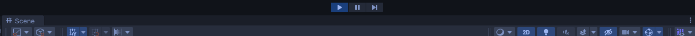

# Unity开发技巧：运行环境

### 运行模式着色

Unity默认在运行模式下，场景内的操作是不会保留的，所以很容易出现开发者没注意是运行模式，进行了修改，结果没有保存的情况。那么可以使用运行模式着色，提醒开发者正在运行模式内。设置地址如下：

```
Windows: Edit -> Preference -> Colors -> Playmode tint
Mac: Unity -> Preference-> Colors -> Playmode tint
```

  

只需要修改这里的颜色后，在运行模式时，窗口就会被加上颜色，如下：

  

### 运行模式下改动

假如你也根本没有注意到运行模式的着色，还是修改了内容，也有办法保存。

### 使用Debug.log 的第二个参数，实现调试时定位到GameObject

我们调试时，有可能会遇到一堆Debug.log的信息，只需要加入第二个参数，在Console窗口里直接点击这条信息，就可以自动定位到对应的GameObject。

```Csharp
Debug.Log("试试这个", this.gameObject);
```
### 使用Debug.Break()暂停调试

在代码里使用Debug.Break()直接在所在位置暂停。


